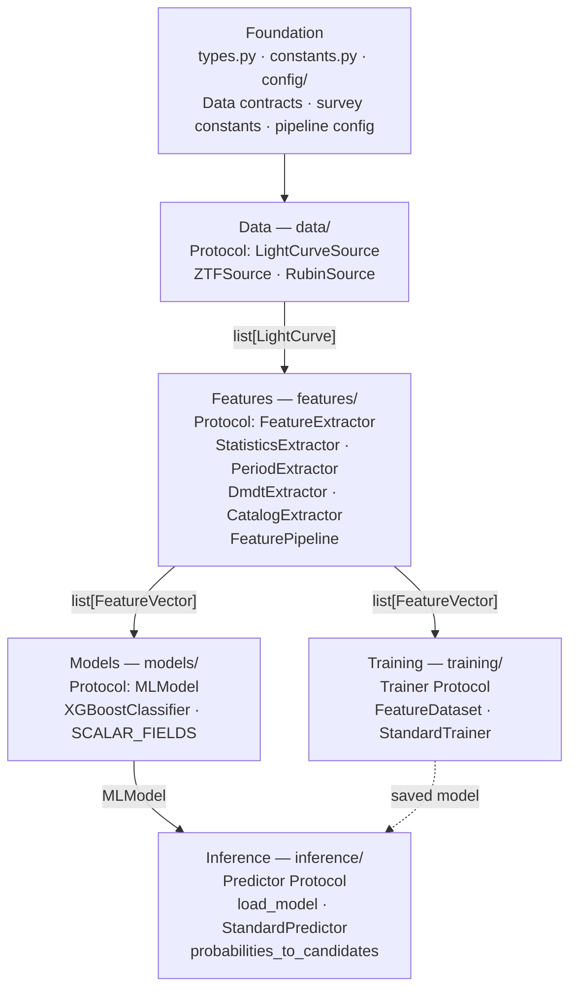
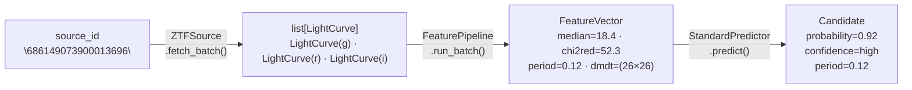
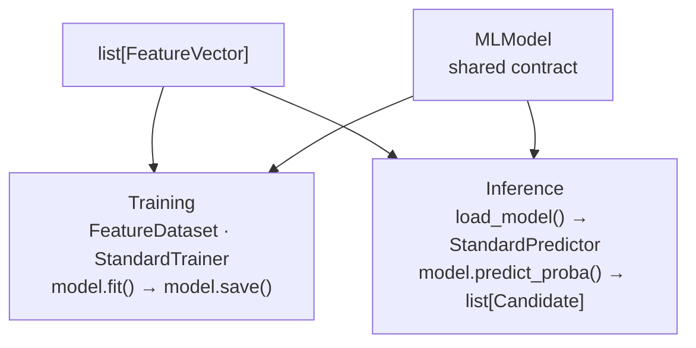

# Architecture Overview

ml4em is organized into six layers. Each layer has a single responsibility, a
well-defined Protocol interface, and strict dependency rules.

---

## The six layers

**Dependency rule:** each layer imports only from layers above it. Training and
inference are parallel — neither imports from the other.

---

## Data flow — one source, end to end

Here is what happens to a single astronomical source as it passes through the pipeline:

---

## Training vs. inference — parallel branches

Training and inference are **parallel branches** that share only the `FeatureVector`
(input) and `MLModel` (the contract) from the models layer:

Neither training nor inference imports from the other. You can run inference without
ever training (load a pre-trained model), or train without doing inference.

---

## Protocol table

Every layer boundary is a Protocol. Here is the complete list:

| Protocol | Defined in | Method signatures | Concrete implementations |
|----------|-----------|------------------|--------------------------|
| `LightCurveSource` | `data/base.py` | `fetch_batch()` | `ZTFSource`, `RubinSource` |
| `FeatureExtractor` | `features/base.py` | `extract()` | `StatisticsExtractor`, `PeriodExtractor`, `DmdtExtractor`, `CatalogExtractor` |
| `MLModel` | `models/base.py` | `predict_proba()`, `save()` | `XGBoostClassifier` |
| `Trainer` | `training/base.py` | `fit()`, `save()` | `StandardTrainer` |
| `Predictor` | `inference/base.py` | `predict()` | `StandardPredictor` |

---

## The three shared types

Three dataclasses are the only objects that cross layer boundaries:

| Type | Flows between | Description |
|------|--------------|-------------|
| `LightCurve` | Data → Features | Single-band time series for one source |
| `FeatureVector` | Features → Models / Training / Inference | Fully extracted feature set |
| `Candidate` | Inference → output | Classification result for one source |

See [Data Contracts](../data-contracts.md) for full field tables.

---

## Navigate to a layer

| # | Layer | Responsibility | Receives | Produces |
|---|-------|---------------|----------|---------|
| 1 | [**Foundation**](../layers/foundation.md) | Shared types, constants, config | — | `LightCurve`, `FeatureVector`, `PipelineConfig` |
| 2 | [**Data**](../layers/data.md) | Fetch light curves from surveys | `source_id` | `list[LightCurve]` |
| 3 | [**Features**](../layers/features.md) | Extract numerical features | `list[LightCurve]` | `FeatureVector` |
| 4 | [**Models**](../layers/models.md) | Define the ML model contract | `FeatureVector` | `np.ndarray` (probabilities) |
| 5 | [**Training**](../layers/training.md) | Load labels and fit a model | `FeatureVector` + labels CSV | saved model file |
| 6 | [**Inference**](../layers/inference.md) | Run a saved model on new data | `FeatureVector` + model file | `list[Candidate]` |
