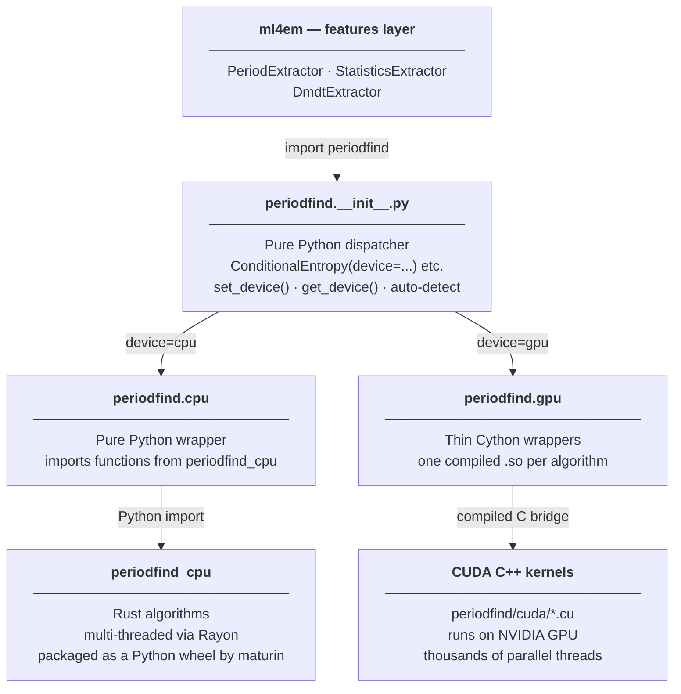

# periodfind

periodfind is an external library — a git submodule at `external/periodfind` — that ml4em depends on for all period-finding and basic statistics computation. It is not a standard Python package you can find on PyPI; it must be compiled from source as part of setting up the project. That compilation step is what the Docker and Conda setup processes are doing when they take a long time.

---

## Why Python alone is too slow

Period finding is a brute-force search. For each of 10,000+ candidate periods, the algorithm folds the light curve, computes a test statistic, and records the result. Repeat for every source in your batch.

For a typical batch of 1,000 light curves × 10,000 trial periods, that is 10 billion elementary operations. Python executes roughly 10–50 million simple operations per second. At that rate, a single batch would take **hours**.

The same computation runs in **seconds** when implemented in a language that compiles down to native machine code and runs on all available CPU cores or GPU threads simultaneously. That is what periodfind does.

---

## The two backends

periodfind provides the same algorithms under two completely different computational engines, selectable at runtime:

| | CPU backend | GPU backend |
|---|---|---|
| **What runs the computation** | The server/laptop CPU, using all available cores | An NVIDIA GPU (graphics card), using thousands of parallel threads |
| **Language the algorithms are written in** | Rust | CUDA C++ |
| **How Python talks to it** | PyO3 + maturin | Cython |
| **Package it lives in** | `periodfind_cpu` (a separate installable wheel) | compiled `.so` files inside the `periodfind` package |
| **When to use** | Local development, CPU-only compute nodes | GPU nodes on MSI (A100) |

---

## Architecture



---

## Python dispatcher

`periodfind/__init__.py` is pure Python — no compilation involved. It provides factory functions (`ConditionalEntropy()`, `AOV()`, `LombScargle()`, ...) that check which hardware is available and hand off to the appropriate backend.

Device selection:

- **`set_device('cpu')`** or **`set_device('gpu')`** — override globally for all calls
- **Auto-detect** (default) — tries to import the CUDA extension and run `nvidia-smi`; falls back to `'cpu'` if no GPU is found

Every factory function follows the same pattern:

```python
def ConditionalEntropy(**kwargs):
    device = _resolve_device(kwargs.pop("device", None))
    if device == "gpu":
        from periodfind.gpu import ConditionalEntropy as _Cls
    else:
        from periodfind.cpu import ConditionalEntropy as _Cls
    return _Cls(**kwargs)
```

The object returned has the same `.calc()` method regardless of which backend is selected.

---

## CPU backend — Rust + Rayon + PyO3 + maturin

### What is Rust?

Rust is a programming language designed for speed and reliability. Like C++, it compiles directly to machine code rather than being interpreted at runtime, making it typically **10–100× faster than Python** for computation-heavy loops. Unlike C++, Rust's compiler catches whole categories of bugs (crashes, memory corruption) before the code ever runs. It has become popular in scientific computing precisely because it is fast without being dangerous.

### What is Rayon?

Rayon is a Rust library for parallel computation. It automatically distributes a batch of light curves across all available CPU cores — no manual thread management needed. A typical MSI compute node has 64+ cores; Rayon uses all of them simultaneously.

### What is PyO3?

PyO3 is a system that lets you annotate Rust functions so Python can call them directly. Instead of writing thousands of lines of "glue code" to connect Python and Rust, you add one annotation (`#[pyfunction]`) above each Rust function, and PyO3 generates the bridge automatically. From Python's perspective, the Rust functions look like normal Python functions.

### What is maturin?

maturin is a build tool that takes the compiled Rust+PyO3 code and packages it into a standard Python wheel file (`.whl`). A wheel is the standard format for distributing pre-compiled Python packages — the same format you get when you `pip install numpy`. The result, `periodfind_cpu`, installs with `pip install periodfind_cpu-*.whl` just like any other Python package.

### How the CPU path works end to end

```
rust/src/ce.rs          Rust source — Conditional Entropy algorithm
       ↓   (rustc compiler + Rayon for multi-threading)
    .so file            compiled Rust binary
       ↓   (PyO3 annotations → Python-callable functions)
periodfind_cpu          Python wheel
       ↓   (pip install)
periodfind.cpu          imports calc_ce_batched, calc_aov_batched, ...
       ↓   (normal Python function call)
    your code           periodfind.ConditionalEntropy(device='cpu').calc(...)
```

When `.calc()` is called, execution jumps from Python directly into compiled Rust code, distributes the batch across all CPU cores via Rayon, and returns results as NumPy arrays.

---

## GPU backend — CUDA C++ + Cython

### What is a GPU and why does it help?

A GPU (Graphics Processing Unit) is a chip originally designed to render video game graphics. To draw 4K video at 60 frames per second, a GPU must perform billions of simple arithmetic operations every second — it does this by having **thousands of small computing cores** working in parallel rather than a handful of powerful ones like a CPU. NVIDIA's A100 (the GPU on MSI's a100 partition) has 6,912 cores.

Period finding maps perfectly onto this architecture: each (source, trial-period) pair is an independent computation that can run on its own GPU core simultaneously. A batch of 1,000 sources × 10,000 periods means 10 million independent jobs that a GPU can start simultaneously.

### What is CUDA?

CUDA (Compute Unified Device Architecture) is NVIDIA's system for programming GPUs. It extends C++ with special annotations that let you write functions that run on the GPU (called "kernels") and launch thousands of instances of them simultaneously. CUDA code lives in `.cu` files and is compiled by NVIDIA's `nvcc` compiler. The output is code that runs entirely on the GPU.

### What is Cython?

Cython is a tool that bridges Python and compiled code. You write files in `.pyx` format — code that looks almost exactly like Python but with optional type annotations — and Cython translates it into C source code, which is then compiled into a `.so` file (a compiled extension) that Python can import. Cython is widely used in scientific Python (NumPy, SciPy, and many astronomy packages use it internally).

In periodfind's GPU path, the Cython `.pyx` files act as a thin bridge: they receive batches of light curve data from Python, pass them into the CUDA C++ code, and return the results as NumPy arrays.

### How the GPU path works end to end

```
periodfind/cuda/ce.cu   CUDA C++ — Conditional Entropy kernel (runs on GPU)
periodfind/ce.pyx       Cython — receives data from Python, calls CUDA
       ↓   (nvcc compiles .cu; Cython compiles .pyx; linked together)
periodfind.ce.so        compiled extension — Python can import this
       ↓   (import)
periodfind.gpu          wraps the .so — exposes ConditionalEntropy class
       ↓   (normal Python function call)
    your code           periodfind.ConditionalEntropy(device='gpu').calc(...)
```

When `.calc()` is called, data moves from CPU memory to GPU memory, the CUDA kernel launches thousands of threads simultaneously (one per source-period pair), and results are copied back to CPU memory as NumPy arrays.

### Per-algorithm structure

Each algorithm has its own Cython wrapper + CUDA kernel pair. They are compiled into separate `.so` files:

| Algorithm | Cython file | CUDA kernel |
|-----------|-------------|-------------|
| Conditional Entropy | `ce.pyx` | `cuda/ce.cu` |
| Analysis of Variance | `aov.pyx` | `cuda/aov.h` |
| Lomb-Scargle | `ls.pyx` | `cuda/ls.cu` |
| Multi-Harmonic Fourier | `mhf.pyx` | `cuda/mhf.cu` |
| Fast Phase-folding Weighted | `fpw.pyx` | `cuda/fpw.cu` |
| Box Least Squares | `bls.pyx` | `cuda/bls.cu` |
| Matched Filter | `mf.pyx` | `cuda/mf.cu` |
| Viterbi Narrowband | `vn.pyx` | `cuda/vn.h` |

---

## Two independent compilation units

The Rust code and the Cython+CUDA code are completely independent — they share no source files and neither calls the other at any level. They produce separate outputs and are built by separate tools.

| Unit | Source | Output | Build tool | ~Build time |
|------|--------|--------|------------|-------------|
| `periodfind_cpu` | `rust/src/*.rs` | Python wheel | maturin | ~15–20 min |
| GPU extensions | `periodfind/*.pyx` + `cuda/*.cu` | `.so` per algorithm | Cython + nvcc | ~8–12 min |

The one ordering constraint: `periodfind_cpu` must be installed before `pip install external/periodfind` runs, because `pyproject.toml` lists it as a pip dependency:

```toml
[project]
dependencies = ["periodfind_cpu>=0.1.0"]
```

This is a pip-level requirement — pip checks that `periodfind_cpu` is installed before proceeding. It does not mean the CUDA code links against the Rust binary.

This independence is exploited by the Dockerfile, which copies and compiles each unit in its own layer. If you change only a `.rs` file, Docker rebuilds only the Rust layer and reuses the cached Cython+CUDA layer, and vice versa.

---

## Source directory

```
external/periodfind/
├── rust/                             # ── periodfind_cpu (Rust wheel) ──────────
│   ├── src/
│   │   ├── lib.rs                    # PyO3 module entry point
│   │   ├── ce.rs                     # Conditional Entropy
│   │   ├── aov.rs                    # Analysis of Variance
│   │   ├── ls.rs                     # Lomb-Scargle
│   │   ├── mhf.rs                    # Multi-Harmonic Fourier
│   │   ├── fpw.rs, bls.rs, mf.rs, vn.rs   # other algorithms
│   │   ├── basicstats.rs             # 22 light curve summary statistics
│   │   ├── dmdt.rs                   # Δmag/Δt histogram
│   │   ├── fourier.rs                # Fourier decomposition
│   │   └── fold.rs, peaks.rs, highcadence.rs   # utilities
│   └── Cargo.toml                    # Rust package manifest
│
├── periodfind/                       # ── GPU extensions + Python package ──────
│   ├── __init__.py                   # Python dispatcher (factory functions, device management)
│   ├── _utils.py                     # input validation
│   ├── cpu/
│   │   └── __init__.py               # CPU backend — imports from periodfind_cpu wheel
│   ├── gpu/
│   │   └── __init__.py               # GPU backend — imports from compiled .so files
│   ├── ce.pyx, aov.pyx, ls.pyx       # Cython wrappers — one per algorithm
│   ├── mhf.pyx, fpw.pyx, bls.pyx, mf.pyx, vn.pyx
│   └── cuda/
│       ├── ce.cu, ls.cu, mhf.cu      # CUDA C++ kernels
│       ├── fpw.cu, bls.cu, mf.cu
│       ├── aov.h, vn.h               # header-only CUDA kernels
│       └── errchk.cuh                # GPU error checking utility
│
├── setup.py                          # Builds Cython + CUDA extensions
└── pyproject.toml                    # Declares periodfind_cpu as pip dependency
```

---

## Why setup takes so long

When you run `sbatch slurm/setup_conda.sh` or `docker build`, you are not downloading a pre-built package — you are **compiling programs from source code** on the server. This is why setup takes 20–45 minutes rather than seconds.

Here is what is actually happening and why each step is slow:

### Step 1 — Rust compilation (~15–20 min)

The Rust compiler (`rustc`) reads all the `.rs` source files and translates them into optimized machine code. Unlike Python, Rust performs this work upfront rather than at runtime. The compiler does extensive analysis to verify correctness and apply aggressive optimizations (essentially, it checks millions of possible execution paths to find the most efficient one). This is inherently slow. A Rust codebase that takes 20 minutes to compile might run in milliseconds once built.

maturin then packages the compiled binary into a Python wheel (`.whl` file). This packaging step is fast; almost all the time is in the Rust compilation itself.

### Step 2 — CUDA compilation (~8–12 min on GPU nodes, skipped on CPU-only)

NVIDIA's `nvcc` compiler translates the `.cu` CUDA C++ files into GPU machine code. GPU hardware comes in many generations (V100, A100, H100, ...), each with a different instruction set. By default, `nvcc` compiles for multiple GPU architectures simultaneously — essentially building the same code several times over. This multiplies the compilation time.

Cython then translates the `.pyx` wrapper files into C code, which is compiled and linked with the CUDA output into the final `.so` extension files.

### Why it only happens once (per environment)

Neither step needs to be repeated unless the source code changes:

| What changed | What needs to rebuild |
|---|---|
| `src/ml4em/` Python code | Nothing — Python is interpreted, changes take effect immediately |
| `rust/src/*.rs` | Rust step only |
| `periodfind/*.pyx` or `cuda/*.cu` | Cython+CUDA step only |
| `pyproject.toml` (Python deps only) | Nothing compiled — just `pip install` |
| Both Rust and CUDA source | Both steps |

In Docker, each compilation step is cached as a separate image layer. If only the Rust source changes, Docker reuses the cached CUDA layer and only recompiles Rust. The Dockerfile was structured deliberately to exploit this: the two compilation units are `COPY`d and built in separate layers so that changing one never invalidates the other's cache.

For Conda (on MSI), there is no automatic caching — if you need to rebuild, you re-run the full setup job. This is the main practical advantage of the Apptainer path: the Docker image is built once on GitHub's servers and cached on GHCR; MSI just downloads the finished result.
