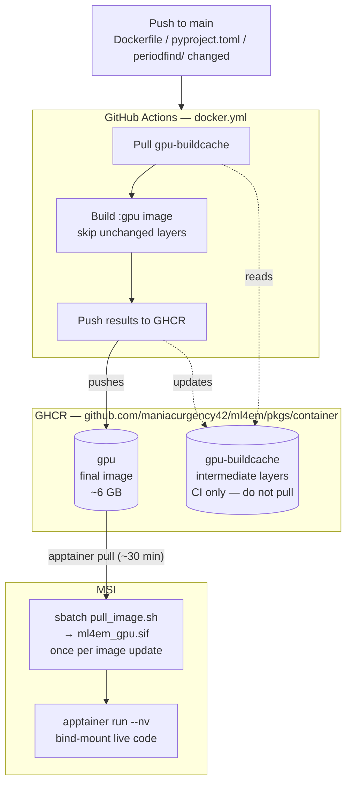

# Docker & GHCR

ml4em depends on `periodfind`, a library that must be compiled from Rust and CUDA C++
source code. Because that compilation requires a specific toolchain (Rust, `nvcc`, CUDA
headers), the fully compiled environment is baked into a Docker image and stored on
GHCR so researchers never have to compile anything themselves.

---

## What is Docker?

Docker is a tool for packaging an entire software environment — the operating system,
system libraries, compilers, and Python packages — into a single portable file called
an **image**. When you run an image, Docker starts an isolated environment (a
**container**) that behaves identically regardless of what machine it runs on.

In ml4em, the Docker image contains:
- Ubuntu 22.04 + CUDA 11.8 runtime and development libraries
- A compiled `periodfind_cpu` Rust wheel
- Compiled Cython + CUDA extensions for `periodfind`
- All Python dependencies from `pyproject.toml`
- `ml4em` itself, installed in editable mode

Researchers on MSI never interact with Docker directly — Apptainer converts the Docker
image into a `.sif` file and runs it. See [Deployment → Apptainer](../apptainer-deployment.md).

---

## What is GHCR?

GHCR (GitHub Container Registry) is GitHub's built-in Docker image registry — a place
to store and distribute Docker images, integrated directly with a GitHub repository.

GHCR plays **two distinct roles** in this project:

| Role | Artifact | Who uses it |
|------|----------|-------------|
| **Distribution** | `ghcr.io/maniacurgency42/ml4em:gpu` | MSI — pulled via `apptainer pull` |
| **Build cache** | `ghcr.io/maniacurgency42/ml4em:gpu-buildcache` | GitHub Actions only — never pull this directly |

The `gpu-buildcache` artifact stores intermediate Docker build layers between CI runs.
Without it, GitHub Actions runners (which are ephemeral — they reset after every job)
would recompile Rust (~20 min) and CUDA (~10 min) from scratch on every push. With the
cache, CI reuses compiled layers and only rebuilds what changed.

---

## How it all fits together



| You are… | What you need to do |
|----------|---------------------|
| Running the pipeline or adding a model | `apptainer pull` once, then `git pull` for updates |
| Adding a new Python dependency (`pyproject.toml`) | Open a PR → merge to `main` → CI rebuilds automatically → re-pull the `.sif` |
| Maintaining the image (periodfind / CUDA / Dockerfile) | Same as above — CI rebuilds on merge |

---

## The Dockerfile

The Dockerfile uses a **multi-stage build** with two targets:

| Target | Base | Purpose |
|--------|------|---------|
| `cpu` | `python:3.11-bookworm` | Local testing, no GPU required |
| `gpu` | `nvidia/cuda:11.8.0-devel-ubuntu22.04` | MSI production runs |

The GPU target is structured to exploit Docker's layer caching. The two compiled
components — the Rust wheel and the CUDA extensions — are copied and built in
**separate layers**, so changing one never invalidates the other's cache:

```
Layer 1  — system packages (apt)           rarely changes
Layer 2  — Python deps from pyproject.toml changes on new pip dep
Layer 3  — periodfind Rust source → wheel  ~20 min if *.rs changes
Layer 4  — periodfind CUDA source → .so    ~10 min if *.pyx or *.cu changes
Layer 5  — ml4em src/ (editable install)   ~1 min, always runs
```

See [Background → periodfind](periodfind.md) for a detailed explanation of what is
being compiled in layers 3 and 4 and why each step takes as long as it does.

---

## CI rebuild times

| What changed | CI rebuild time |
|---|---|
| `src/ml4em/` Python code | ~1–2 min (no recompilation) |
| `pyproject.toml` Python deps only | ~2–5 min (Rust + CUDA layers reused from cache) |
| `rust/src/*.rs` | ~20–25 min (Rust recompiles, CUDA layer reused) |
| `periodfind/*.pyx` or `cuda/*.cu` | ~10–15 min (CUDA recompiles, Rust layer reused) |
| Both Rust and CUDA source | ~30–40 min (full rebuild) |

---

## Building the image (maintainers only)

Merging to `main` triggers the GitHub Actions workflow (`.github/workflows/docker.yml`),
which builds and pushes the GPU image automatically on native x86_64 runners. **You
do not normally need to build locally.**

Only run a local build to test a Dockerfile change before merging, or if CI is
unavailable. On Apple Silicon, `--platform linux/amd64` forces QEMU emulation — the
GPU build will take 3+ hours. Prefer pushing to a branch and letting CI build it.

```bash
# GPU image — for MSI production runs
docker build --platform linux/amd64 --target gpu \
    -t ghcr.io/maniacurgency42/ml4em:gpu .

# CPU image — for local testing only
docker build --platform linux/amd64 --target cpu \
    -t ghcr.io/maniacurgency42/ml4em:cpu .
```

!!! note "Submodule required"
    `periodfind` lives at `external/periodfind` as a git submodule. Make sure it is
    initialized before building:
    ```bash
    git clone --recurse-submodules <repo-url>
    # or after a plain clone:
    git submodule update --init
    ```

---

## Pushing to GHCR (maintainers only)

Authenticate with a GitHub Personal Access Token (PAT):

**GitHub → Settings → Developer Settings → Personal Access Tokens → Tokens (classic) → Generate new token**

Select scopes: `write:packages`, `read:packages`

```bash
echo YOUR_PAT | docker login ghcr.io -u ManiacUrgency42 --password-stdin
```

Then push:

```bash
docker push ghcr.io/maniacurgency42/ml4em:gpu
docker push ghcr.io/maniacurgency42/ml4em:cpu
```

The GPU image is 5–8 GB. If the push times out mid-upload, rerun — Docker skips
already-uploaded layers.

!!! note "First push only"
    After the first push, make the package public so MSI can pull without credentials:
    **GitHub → your profile → Packages → ml4em → Package Settings → Change visibility → Public**
