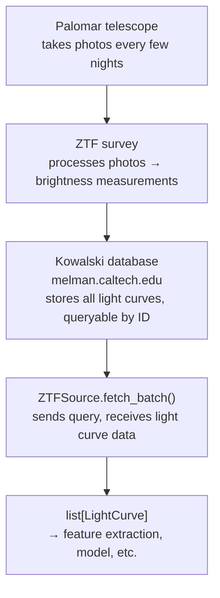

# Surveys — ZTF & Rubin

An astronomical survey is a telescope program that systematically scans large areas of
sky and returns to the same patches repeatedly over months or years, building up
time-series data on millions of sources.

ml4em currently supports two surveys and has stubs for a third (simulated data).

---

## ZTF — Zwicky Transient Facility { #ztf }

ZTF is a camera mounted on a telescope at Palomar Observatory in California. Every few
nights it scans the entire northern sky, recording brightness measurements for millions
of stars in three optical filters — g (blue-green), r (red), and i (near-infrared). It
has been doing this since 2018.

Each pass through the sky adds one more data point to every star's record. Over years
of repeated observations, each star accumulates a **light curve** — a time series of
how its brightness changed. That is your raw data.

ZTF has observed roughly a billion sources. The full dataset is many terabytes.

- **Active since:** 2018
- **Bands:** g (green), r (red), i (near-infrared)
- **Typical cadence:** one observation per source per band every 2–3 nights

### Kowalski — ZTF's database

You can't just download a billion light curves. **Kowalski** is a database system built
by Caltech that stores all of ZTF's data and lets you query it programmatically. You
send it a list of source IDs and it sends back the corresponding light curves.

Kowalski is organized into collections. The one used by ml4em —
`ZTF_sources_84525009` — contains ~84 million sources from ZTF DR20. Each document
in that collection is one single-band light curve for one sky position, identified by
an integer `_id`.

ml4em talks to Kowalski via the **penquins** Python client at `melman.caltech.edu`.
Kowalski is not publicly accessible — you need an account and an API token
(`ML4EM_ZTF_TOKEN` in your `.env`).

### How it fits together



### ZTF source IDs

Each ZTF source has a numeric `_id` (e.g., `686149073900013696`) that encodes a
(sky position, band) pair. One star at a given position observed in g, r, and i bands
produces **three different** `_id` values. You pass these numeric IDs to
`ZTFSource.fetch()` or `ZTFSource.fetch_batch()`.

### catflags — quality flags { #catflags }

Every individual ZTF observation comes with a `catflags` integer that records data
quality problems. If `catflags != 0`, the observation is flagged as unreliable — for
example, because the source fell near a cosmic ray hit, or because conditions were poor.

`ZTFSource` silently discards all observations where `catflags != 0`. The resulting
light curve contains only clean measurements.

### Cadence and intra-night duplicates

ZTF sometimes observes the same source multiple times in a single night. Observations
separated by less than 30 minutes (`ZTF_MIN_CADENCE_DAYS = 30/1440 days`) are treated
as duplicates and all but the first are removed. This prevents the nightly cadence from
creating a spurious ~0.02-day "period" signal in the period-finding step.

### Data releases

ZTF periodically publishes frozen snapshots of its catalog. The constant
`ZTF_DR16_MAX_HJD` in `constants.py` is the maximum timestamp in ZTF Data Release 16.
Queries can be filtered to stay within a specific release using
`sources.ztf.max_timestamp_hjd` in `config.yaml`.

---

## Rubin / LSST — Legacy Survey of Space and Time

Rubin is a 10-year sky survey operating at Vera C. Rubin Observatory in Chile. It will
eventually catalog ~20 billion objects and produce light curves in 6 bands.

- **Status (as of 2025):** DP1 (Data Preview 1) is publicly available
- **Bands:** u, g, r, i, z, y (all six optical bands)
- **Typical cadence:** several visits per band per week; ~1000 visits per source over
  10 years

### RSP — Rubin Science Platform

Access to Rubin data goes through the **Rubin Science Platform (RSP)**, a web portal
and API service. An RSP account and token are required.

### TAP — Table Access Protocol { #tap }

Rubin data is queried via **TAP**, a standard SQL-like web API for astronomical
catalogs. The query language is **ADQL** (Astronomical Data Query Language), which is
essentially SQL with a few astronomy-specific extensions (like `DISTANCE()` for
cone searches).

You can think of TAP as a REST API where your query is an SQL string, and the response
is a table of results. `pyvo` is the Python client for TAP.

### DP1 tables used by ml4em

`RubinSource` queries three tables in the DP1 data release:

| Table | What it contains | Used for |
|-------|-----------------|---------|
| `dp1.Object` | One row per unique sky source | Get `objectId`, `ra`, `dec` |
| `dp1.ForcedSource` | One row per observation per source | Get brightness measurements (`psfFlux`) |
| `dp1.Visit` | One row per telescope exposure | Get timestamps (`expMidptMJD`) and band |

A JOIN across these three tables produces the time series for a given `objectId`.

### objectId

Rubin's unique source identifier. One `objectId` can produce up to **six** `LightCurve`
objects (one per band), depending on how many bands observed the source.

### Forced-source photometry

Unlike "detection-based" photometry (which only records a measurement when the source
is bright enough to be detected), **forced-source photometry** measures brightness at a
source's known position even when it falls below the detection threshold in a given
exposure. This produces a complete time series — including upper limits — rather than a
sparse one with gaps.

### psfFlux and units

Rubin stores brightness as `psfFlux` in units of **nanojanskies** (nJy), a flux density
unit. A Jansky is `10⁻²⁶ W m⁻² Hz⁻¹`; a nanojansky is one billionth of that.

`RubinSource` converts nJy flux to apparent magnitude before returning `LightCurve`
objects:

```
mag = -2.5 × log₁₀(psfFlux / 3631e9)
```

(3631 Jy is the zero-point for the AB magnitude system used by Rubin.)

---

## Gaia

Gaia is covered separately in [Gaia & Stellar Catalogs](gaia.md) because it is used
as a **feature source** (cross-matching source positions to the Gaia catalog to get
distance and color information), not as a light curve source.
