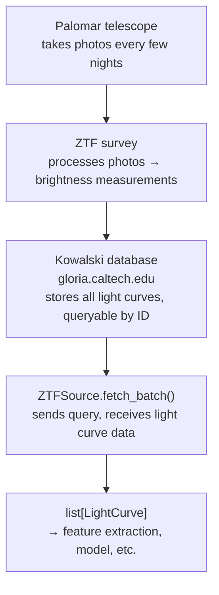

# Surveys — ZTF

An astronomical survey is a telescope program that systematically scans large areas of
sky and returns to the same patches repeatedly over months or years, building up
time-series data on millions of sources.

ml4em currently supports one survey, ZTF, and has a stub for simulated data.

---

## ZTF — Zwicky Transient Facility { #ztf }

ZTF is a camera mounted on a telescope at Palomar Observatory in California. Every few
nights it scans the entire northern sky, recording brightness measurements for millions
of stars in three optical filters — g (blue-green), r (red), and i (near-infrared). It
has been doing this since 2018.

Each pass through the sky adds one more data point to every star's record. Over years
of repeated observations, each star accumulates a **light curve** — a time series of
how its brightness changed. That is your raw data.

ZTF has observed roughly a billion sources. The full dataset is many terabytes.

- **Active since:** 2018
- **Bands:** g (green), r (red), i (near-infrared)
- **Typical cadence:** one observation per source per band every 2–3 nights

### Kowalski — ZTF's database

You can't just download a billion light curves. **Kowalski** is a database system built
by Caltech that stores all of ZTF's data and lets you query it programmatically. You
send it a list of source IDs and it sends back the corresponding light curves.

Kowalski is organized into collections. The one used by ml4em —
`ZTF_sources_20240515` — contains ~84 million sources from ZTF DR20. Each document
in that collection is one single-band light curve for one sky position, identified by
an integer `_id`.

ml4em talks to Kowalski via the **penquins** Python client at `gloria.caltech.edu`.
Kowalski is not publicly accessible — you need an account and an API token
(`ML4EM_ZTF_TOKEN` in your `.env`).

### How it fits together

```mermaid
flowchart TD
    A["Palomar telescope<br/>takes photos every few nights"]
    B["ZTF survey<br/>processes photos → brightness measurements"]
    C["Kowalski database<br/>gloria.caltech.edu<br/>stores all light curves, queryable by ID"]
    D["ZTFSource.fetch_batch()<br/>sends query, receives light curve data"]
    E["list[LightCurve]<br/>→ feature extraction, model, etc."]

    A --> B --> C --> D --> E
```

### ZTF source IDs

Each ZTF source has a numeric `_id` (e.g., `686149073900013696`) that encodes a
(sky position, band) pair. One star at a given position observed in g, r, and i bands
produces **three different** `_id` values. You pass these numeric IDs to
`ZTFSource.fetch()` or `ZTFSource.fetch_batch()`.

### catflags — quality flags { #catflags }

Every individual ZTF observation comes with a `catflags` integer that records data
quality problems. If `catflags != 0`, the observation is flagged as unreliable — for
example, because the source fell near a cosmic ray hit, or because conditions were poor.

`ZTFSource` silently discards all observations where `catflags != 0`. The resulting
light curve contains only clean measurements.

### Cadence and intra-night duplicates

ZTF sometimes observes the same source multiple times in a single night, occasionally
in back-to-back exposures a few minutes apart. Observations separated by less than
5 minutes (`ZTF_MIN_CADENCE_DAYS = 5/1440 days`) are treated as duplicates and all but
the first are removed. This stops a burst of near-simultaneous exposures from imprinting
itself on the periodogram as a spurious very-short "period".

The threshold is deliberately tight. A half-hour cutoff — the conventional choice for a
general variability search — would delete every pair of epochs closer together than
30 minutes, and short-period binaries are exactly the sources whose signal lives there.
It would also be inconsistent with searching down to `min_period_days = 0.003472` d
(5 minutes), since no epoch pair short enough to constrain such a period would
survive the filter.

### Data releases

ZTF periodically publishes frozen snapshots of its catalog. The constant
`ZTF_DR16_MAX_HJD` in `constants.py` is the maximum timestamp in ZTF Data Release 16.
Queries can be filtered to stay within a specific release using
`sources.ztf.max_timestamp_hjd` in `config.yaml`.

---

## Gaia

Gaia is covered separately in [Gaia & Stellar Catalogs](gaia.md) because it is used
as a **feature source** (cross-matching source positions to the Gaia catalog to get
distance and color information), not as a light curve source.
