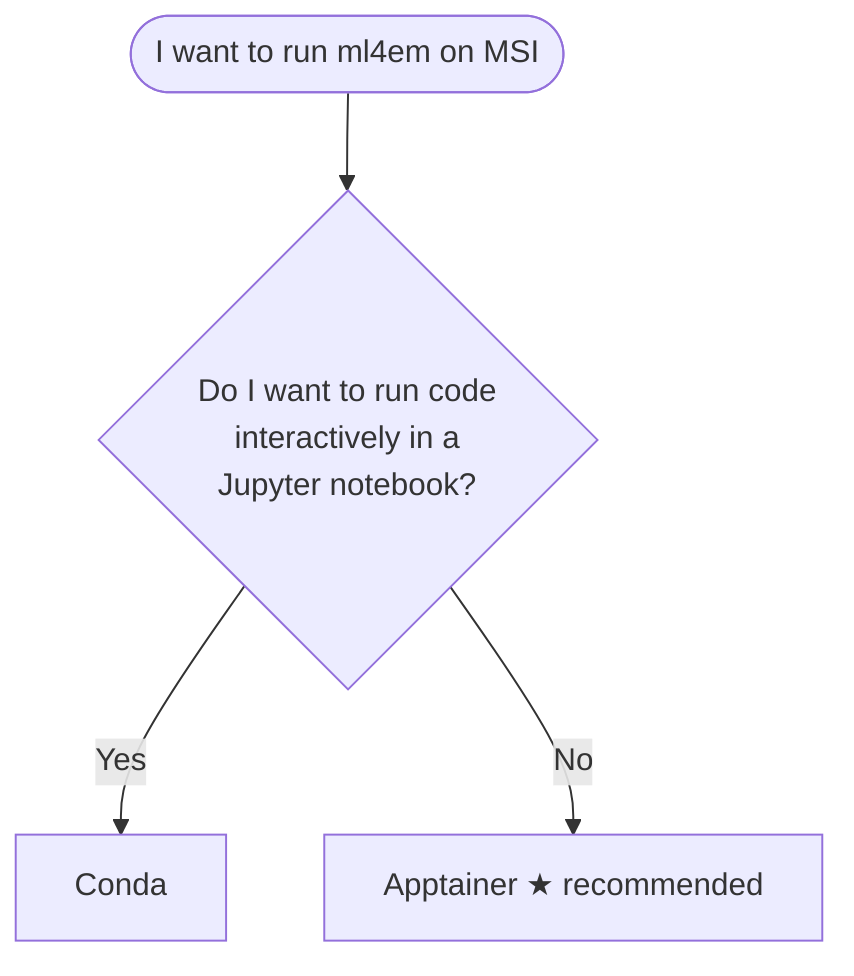

# Deploying on MSI

-   **Apptainer** — recommended for most users

    ---

    Download a pre-built software package and run it directly on MSI. No compilation
    or environment setup required — the package is rebuilt automatically whenever
    the codebase changes. Setup takes about 30 minutes, mostly waiting for a ~6 GB
    download to complete.

    [Apptainer deployment →](apptainer-deployment.md)

-   **Conda**

    ---

    Build a Python environment directly on MSI using the standard conda and pip tools
    you may already know. The right choice if you want to run ml4em interactively in
    a Jupyter notebook, or simply prefer a traditional Python setup. Setup takes
    30–45 minutes and compiles the period-finding library from source on MSI.

    [Conda deployment →](conda-deployment.md)

---

## Not sure which to choose?

If you have no strong preference, go with **Apptainer**. It requires less setup and
is the path used and tested by the core team.

---

## Side-by-side comparison

| | Apptainer ★ | Conda |
|---|---|---|
| **Recommended** | Yes, for most users | For Jupyter / interactive work |
| **Setup time** | ~30 min | ~30–45 min |
| **What setup involves** | Downloading a pre-built ~6 GB software package to MSI | Compiling the period-finding library from source, then installing Python packages |
| **Tools required** | Apptainer (already available on MSI via `module load`) | Conda (already available on MSI via `module load`) |
| **After a code change** | `git pull` — nothing else needed | `git pull` — nothing else needed |
| **Jupyter notebooks** | Not supported | Supported |
| **When you need to redo setup** | Only if the compiled dependencies change (rare) | Only if the compiled dependencies change (rare) |

Both paths install ml4em in **editable mode**: changes to Python source files are
picked up immediately with `git pull` — no rebuild or reinstall needed.
