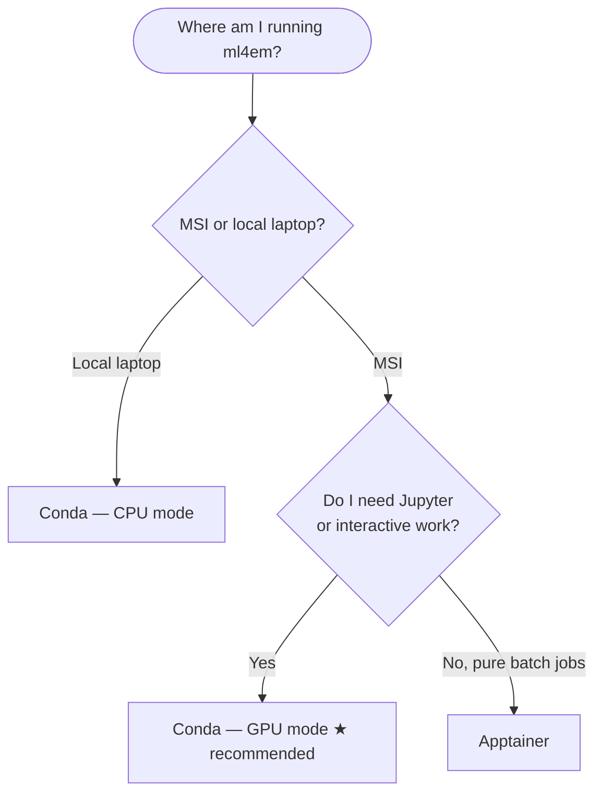

# Deployment

-   **Conda** — recommended for most users

    ---

    Build a Python environment using the standard conda and pip tools. Supports
    Jupyter notebooks and interactive work via MSI Open OnDemand. Setup compiles
    the period-finding library from source — submit one SLURM job and wait.

    **MSI and local** — the same setup works on MSI GPU nodes and on a personal
    laptop (CPU-only mode).

    [Conda deployment →](conda-deployment.md)

-   **Apptainer**

    ---

    Download a pre-built container image and run it directly on MSI. No
    compilation required. The right choice if you want guaranteed reproducibility
    for production batch jobs and do not need Jupyter.

    **MSI only** — Apptainer is available on MSI via `module load` but is not
    a standard tool on personal laptops.

    [Apptainer deployment →](apptainer-deployment.md)

---

## Not sure which to choose?

If you have no strong preference, go with **Conda**. It works for both
interactive exploration and batch jobs, and is the setup used and tested by
the core team.

---

## Side-by-side comparison

!!! note "Why does Conda setup take 30–45 minutes?"
    The setup time is not spent installing Python packages — it is spent
    compiling the period-finding library (`periodfind`) from Rust and CUDA C++
    source code. See [Background → periodfind](background/periodfind.md#why-setup-takes-so-long)
    for a full explanation of what is being compiled and why it only needs to
    happen once.

| | Conda ★ | Apptainer |
|---|---|---|
| **Recommended** | Yes, for most users | For pure batch jobs requiring strict reproducibility |
| **Where it runs** | MSI + local laptop | MSI only |
| **Setup time** | ~30–45 min | ~30 min |
| **What setup involves** | Compiling periodfind from source, then installing Python packages | Downloading a pre-built ~6 GB container image |
| **Jupyter notebooks** | Supported — works with MSI Open OnDemand | Not supported |
| **After a code change** | `git pull` — nothing else needed | `git pull` — nothing else needed |
| **When you need to redo setup** | Only if compiled dependencies change (rare) | Only if compiled dependencies change (rare) |

Both paths install ml4em in **editable mode**: changes to Python source files
are picked up immediately with `git pull` — no rebuild or reinstall needed.
