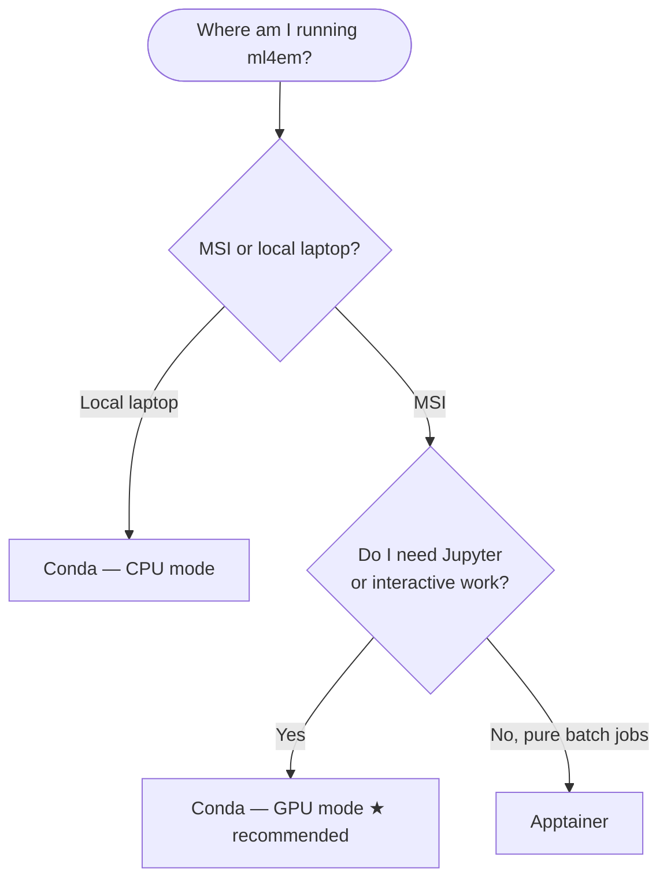

# Deployment

<div class="grid cards" markdown>

-   **Conda** — recommended for most users

    ---

    Build a Python environment using the standard conda and pip tools. Supports
    Jupyter notebooks and interactive work via MSI Open OnDemand. Setup compiles
    the period-finding library from source — submit one SLURM job and wait.

    **MSI and local** — the same setup works on MSI GPU nodes and on a personal
    laptop (CPU-only mode).

    [Conda deployment →](conda-deployment.md)

-   **Apptainer**

    ---

    Download a pre-built container image and run it directly on MSI. No
    compilation required. The right choice if you want guaranteed reproducibility
    for production batch jobs and do not need Jupyter.

    **MSI only** — Apptainer is available on MSI via `module load` but is not
    a standard tool on personal laptops.

    [Apptainer deployment →](apptainer-deployment.md)

</div>

---

## Not sure which to choose?


```mermaid
flowchart TD
    A([Where am I running ml4em?]) --> B{MSI or local laptop?}
    B -- Local laptop --> C[Conda — CPU mode]
    B -- MSI --> D{Do I need Jupyter\nor interactive work?}
    D -- Yes --> E[Conda — GPU mode ★ recommended]
    D -- No, pure batch jobs --> F[Apptainer]
```

If you have no strong preference, go with **Conda**. It works for both
interactive exploration and batch jobs, and is the setup used and tested by
the core team.

---

## Side-by-side comparison

!!! note "Why does Conda setup take 30–45 minutes?"
    The setup time is not spent installing Python packages — it is spent
    compiling the period-finding library (`periodfind`) from Rust and CUDA C++
    source code. See [Background → periodfind](background/periodfind.md#why-setup-takes-so-long)
    for a full explanation of what is being compiled and why it only needs to
    happen once.

| | Conda ★ | Apptainer |
|---|---|---|
| **Recommended** | Yes, for most users | For pure batch jobs requiring strict reproducibility |
| **Where it runs** | MSI + local laptop | MSI only |
| **Setup time** | ~30–45 min | ~30 min |
| **What setup involves** | Compiling periodfind from source, then installing Python packages | Downloading a pre-built ~6 GB container image |
| **Jupyter notebooks** | Supported — works with MSI Open OnDemand | Not supported |
| **After a code change** | `git pull` — nothing else needed | `git pull` — nothing else needed |
| **When you need to redo setup** | Only if compiled dependencies change (rare) | Only if compiled dependencies change (rare) |

Both paths install ml4em in **editable mode**: changes to Python source files
are picked up immediately with `git pull` — no rebuild or reinstall needed.

---

## SLURM conventions { #slurm-conventions }

Everything in `slurm/` and `benchmarks/slurm/` follows the same four rules.
They are not stylistic — each one exists because the obvious alternative fails
silently on MSI.

### Submit from the repository root

```bash
cd ~/ml4em
sbatch slurm/run_demo.sh
sbatch benchmarks/slurm/scaling_gpu.sh
```

`sbatch` copies the submitted script to `/var/spool` on the compute node before
running it, so `${BASH_SOURCE[0]}` inside the job points at the spool copy and
not at your checkout. Every script therefore resolves the repository from
`SLURM_SUBMIT_DIR` — the directory `sbatch` was invoked from — and falls back to
`BASH_SOURCE` only for the case where you run the file directly with `bash`:

```bash
REPO_DIR="${SLURM_SUBMIT_DIR:-$(cd "$(dirname "${BASH_SOURCE[0]}")/.." && pwd)}"
```

Submitting from inside `slurm/` or `benchmarks/slurm/` makes `REPO_DIR` point at
the wrong directory and the job fails on the first path it builds from it.

### `logs/` must already exist

Every script writes to `logs/<name>_%j.out`. SLURM opens that file *before* the
job body runs, so an in-script `mkdir -p logs` is too late — the job is rejected
at submission with an output-file error. The directory is tracked in git via
`logs/.gitkeep`, so a fresh clone already has it and no manual step is needed.

### Partitions

The legacy `a100`, `agsmall` and `amdsmall` partitions no longer exist on MSI.
Current ones:

| Job type | Partition | Extra flags |
|----------|-----------|-------------|
| GPU batch | `msigpu` | `--gres=gpu:a100:1` (or `:4`) |
| CPU batch | `msismall` | — |
| Interactive GPU | `interactive-gpu` | `--gres=gpu:a100:1` |

`msilarge`, `msibigmem`, `msilong`, `preempt-gpu`, `a100-4-long` and
`a100-8-long` also exist but nothing in this repository requests them.

Validate a script's account and partition before queuing it for real:

```bash
sbatch --test-only benchmarks/slurm/scaling_gpu.sh
```

`--test-only` performs the full authorization check and reports the estimated
start time without submitting anything, which catches a wrong `-A` or a
partition you are not authorized for immediately rather than after the job sits
in the queue and then fails.

### Fail-fast preconditions and unbuffered output

Each script sources `$DATA_DIR/.env` and then checks two prerequisites before
doing any work:

```bash
if [[ ! -f "${DATA_DIR}/config_msi.yaml" ]]; then ... exit 1; fi
if [[ -z "${ML4EM_ZTF_TOKEN:-}" ]]; then ... exit 1; fi
```

Both would otherwise surface minutes later as a pydantic validation error or a
Kowalski authentication failure, neither of which names the actual missing file.

`slurm/run_demo.sh` runs the Python step under `apptainer run` against
`ml4em_gpu.sif`; `slurm/run_demo_conda.sh` is its conda counterpart. The demo is
a smoke test, so each version pins one environment and stays readable.

The benchmarks under `benchmarks/slurm/` do the opposite: they run under either
environment, chosen at submission time rather than baked into the file. See
[Benchmarking → Conda or Apptainer](guides/benchmarking.md#launcher). Neither
`apptainer run` nor `conda run --no-capture-output` buffers, so `tail -f` on the
log file shows progress while a multi-hour benchmark is still running.
